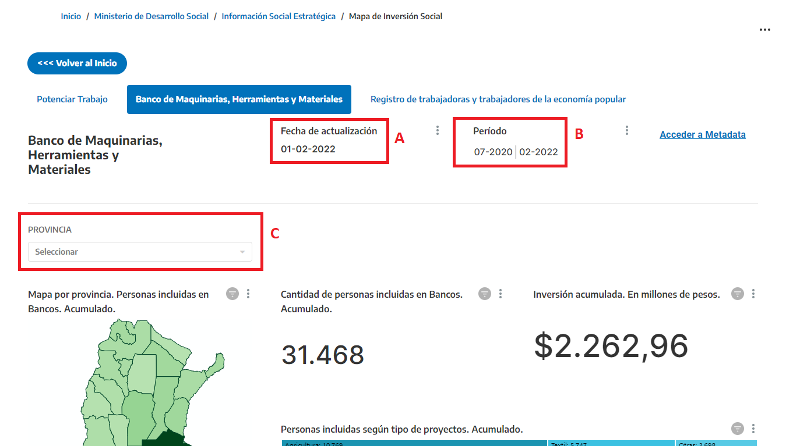

# Mapa de Inversión Social del Ministerio de Desarrollo Social
Accede de manera interactiva a información sobre los principales programas del Ministerio de Desarrollo Social.
En este repositorio vas a encontrar información y metadata del [Mapa de Inversión Social del Ministerio de Desarrollo Social de la Nación](https://reportes.mds.gob.ar)

## Contenido
### ¿Qué es el Mapa de Inversión Social?
El **Mapa de Inversión Social** es una herramienta interactiva de visualización de información sobre los principales programas que implementa el Ministerio de Desarrollo Social (MDS).

La información continua, sistemática y pertinente permite al MDS elaborar diagnósticos y realizar el monitoreo, la planificación, la evaluación de los programas y su impacto en la situación social. 

### ¿Cuál es el objetivo del Mapa de Inversión Social?

La producción y difusión de información constituye uno de los principios rectores para el desarrollo de políticas públicas sustentadas en el enfoque de derechos. Así, el **Mapa de Inversión Social** te permite conocer y utilizar información proveniente de los principales programas sociales implementados por el MDS, de una manera rápida y amigable.  

### ¿Qué información presenta el Mapa de Inversión Social?

El **Mapa de Inversión Social** te permite acceder a información sobre el alcance, la distribución geográfica y la inversión que realiza el Estado nacional en los principales programas sociales. La información visualizada se organiza en cuatro ejes:

- Inclusión Sociolaboral y Desarrollo Local
- Integración Sociourbana
- Cuidados de la primera infancia y adolescencia
- Seguridad y soberanía alimentaria

También podés acceder a  información que surge del monitoreo de indicadores sociodemográficos y de estudios estratégicos que realiza el MDS.

### ¿Cuál es la fuente de información del Mapa de Inversión Social?

El **Mapa de Inversión Social** se nutre de información del monitoreo permanente que realiza la Dirección General de Información Social Estratégica del MDS. Los datos visualizados para cada programa o prestación corresponde a la información más reciente, provista por las distintas Secretarías del Ministerio. 

### ¿Cómo se navega el Mapa de Inversión Social?

Para comenzar a navegar el **Mapa de Inversión Social** tenés que elegir un programa o prestación. Dentro de cada tablero podrás visualizar mapas y distintos tipos de gráficos. 

La **FECHA DE ACTUALIZACIÓN (A)** indica el día en que la información de cada uno de los programas y prestaciones ha sido actualizada.

El **PERIODO (B)** indica el plazo comprendido entre el primero y el último mes de información disponible sobre el programa o prestación que se visualiza.

Podrás utilizar el **FILTRO de Provincias (C)**, para poder acceder a información específica de una provincia en particular. 

### Listado de reportes
#### Potenciar Trabajo
- [Metadata](potenciar-trabajo.md) 
- [Reporte](https://reportes.mds.gob.ar/superset/dashboard/p/AP1v00rPvbo/)
#### Banco de Maquinarias, Herramientas y Materiales
- [Metadata](banco-de-herramientas.md) 
- [Reporte](https://reportes.mds.gob.ar/r/6)
#### Trabajadores y trabajadoras de la Economía Popular
- [Metadata](renatep.md) 
- [Reporte](https://reportes.mds.gob.ar/r/7)
#### Proyectos de Integración sociourbana
- [Metadata](proyectos-integracion-sociourbana.md) 
- [Reporte](https://reportes.mds.gob.ar/r/13)
#### Mi Pieza
- [Metadata](mi-pieza.md) 
- [Reporte](https://reportes.mds.gob.ar/r/14)
#### Mapa de Integración sociourbana
- [Metadata](mapa-de-integración-sociourbana.md) 
- [Reporte](https://reportes.mds.gob.ar/superset/dashboard/4/)
#### Mejor Barrio
- [Metadata](mejor-barrio.md) 
- [Reporte](https://reportes.mds.gob.ar/r/15)
#### Plan Nacional de Primera Infancia
- [Metadata](plan-nacional-de-primera-infancia.md.md) 
- [Reporte](https://reportes.mds.gob.ar/r/15)
#### Construcción y refacción de Centros de Desarrollo infantil
- [Metadata](apoyo-plan-nacional-de-primera-infancia.md.md) 
- [Reporte](https://reportes.mds.gob.ar/r/16)
#### Inclusión Joven
- [Metadata](potenciar-inclusion-joven.md.md) 
- [Reporte](https://reportes.mds.gob.ar/r/17)
#### Programa Reparación económica para niñas, niños y adolescentes
- [Metadata](rennya.md.md) 
- [Reporte](https://reportes.mds.gob.ar/superset/dashboard/p/onEpBb0Yp95/)
#### Programa de acompañamiento para el egreso de jóvenes sin cuidados parentales
- [Metadata](pae.md) 
- [Reporte](https://reportes.mds.gob.ar/superset/dashboard/p/Z20vaoLd87V/)
#### Prestación alimentar
- [Metadata](prestación-alimentar.md.md) 
- [Reporte](https://reportes.mds.gob.ar/r/18)
#### Comedores escolares
- [Metadata](comerdores-escolares.md.md) 
- [Reporte](https://reportes.mds.gob.ar/r/51)
#### Comedores comunitarios y merenderos
- [Metadata](comedores-comunitarios-merenderos.md.md) 
- [Reporte](https://reportes.mds.gob.ar/r/19)
#### Estudios sobre prestación Alimentar
- [Metadata](estudios-estrategicos-prestación-alimentar.md.md) 
- [Reporte](https://reportes.mds.gob.ar/r/23)
#### Estudio sobre endeudamientos de sectores populares
- [Metadata](estudios-estrategicos-endeudamiento.md.md) 
- [Reporte](https://reportes.mds.gob.ar/r/25)
#### Indicadores de mercado de trabajo
- [Metadata](mercado-de-trabajo.md.md) 
- [Reporte](https://reportes.mds.gob.ar/r/20)

### ¿Dudas u sugerencias?
Podés [abrir un issue](https://github.com/datos-desarrollosocial-nacion/metadata-mapa-de-inversion-social/issues/new).
